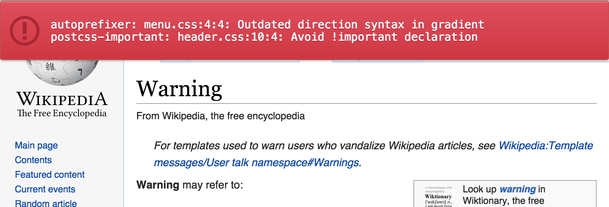

# PostCSS Browser Reporter

[PostCSS] plugin to report warning messages right in your browser.

If a plugin before this one is throwing a warning, this plugin will append warning messages to `html:before`.




## Usage

**Step 1:** Install plugin:

```sh
npm install --save-dev postcss postcss-browser-reporter
```

**Step 2:** Check your project for existing PostCSS config: `postcss.config.js`
in the project root, `"postcss"` section in `package.json`
or `postcss` in bundle config.

If you do not use PostCSS, add it according to [official docs]
and set this plugin in settings.

**Step 3:** Add the plugin to plugins list:

```js
module.exports = {
  plugins: [
+   require('postcss-browser-reporter'),
    require('autoprefixer')
  ]
}
```

[official docs]: https://github.com/postcss/postcss#usage


## Options

### `selector`

You can override selector that will be used to display messages:

```js
  require('postcss-browser-reporter')({
    selector: 'body:before'
  })
```

Type: `String`. Default: `html::before`.


### `styles`

You can override default styles applied to the selector:

```js
  require('postcss-browser-reporter')({
    styles: {
      color: 'gray',
      'text-align': 'center'
    }
  })
```

Type: `Object`. Default: opinionated styles.
